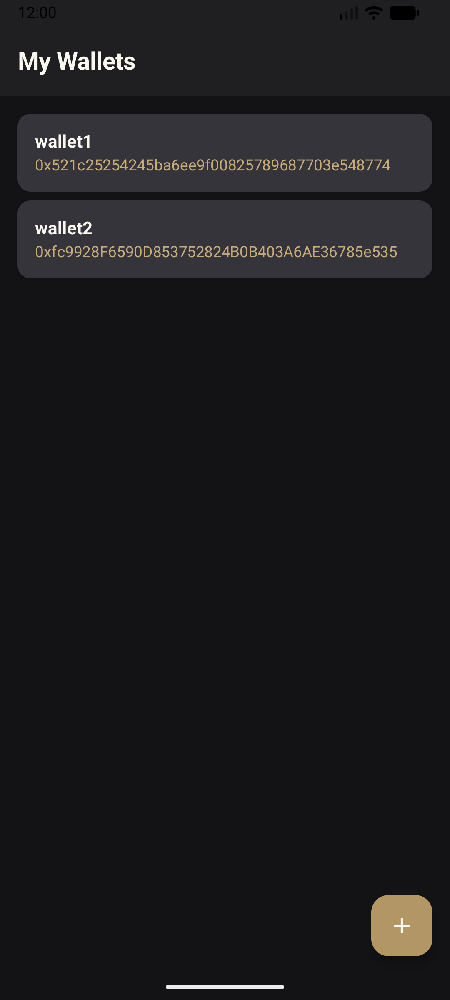
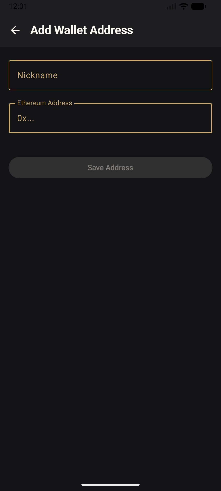
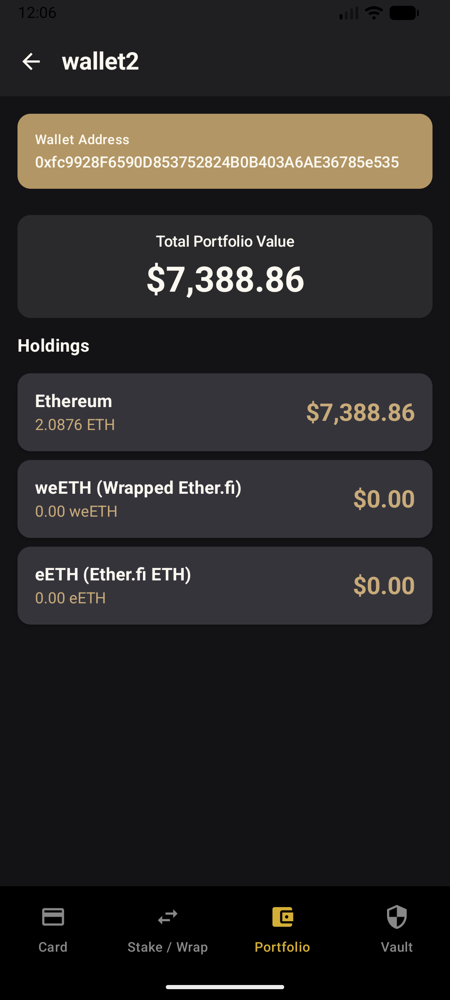
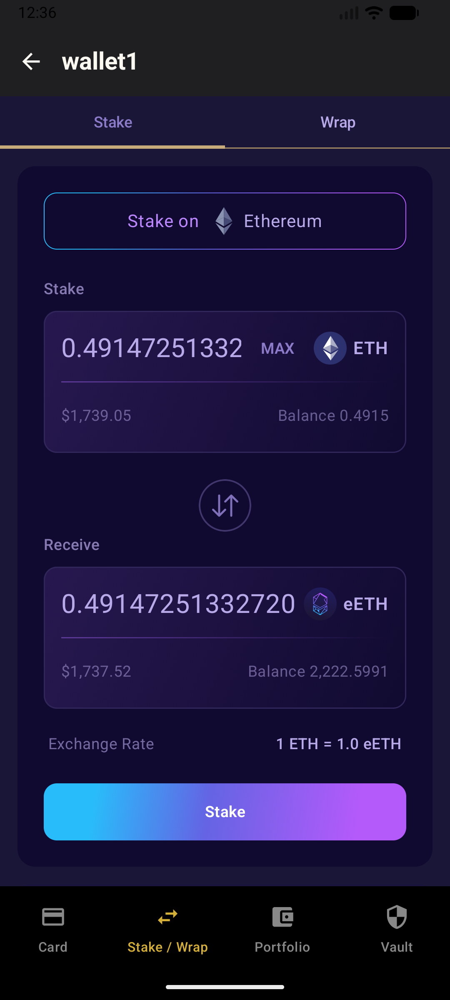
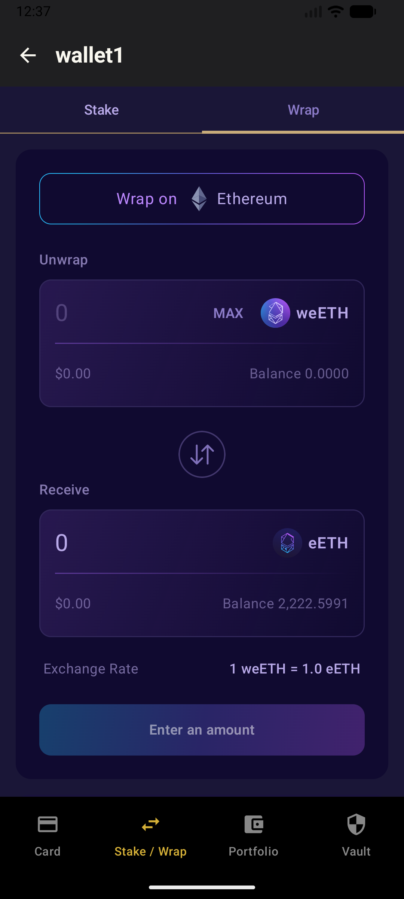
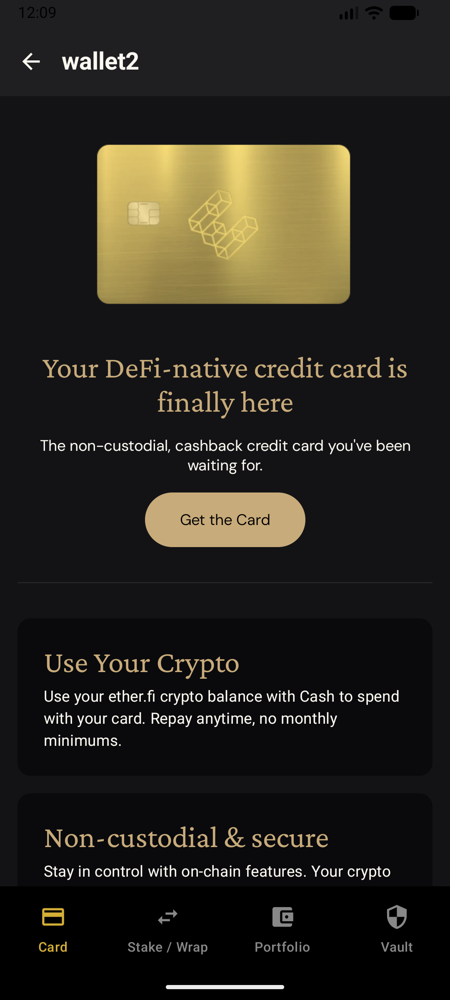

# Ether.fi Portfolio Tracker

A native Android application for tracking Ether.fi portfolio balances, built with a modern, 100% Kotlin and Jetpack Compose architecture. This app allows users to add multiple Ethereum wallets and view their holdings of ETH, eETH, and weETH.

## 📸 Screenshots

|                  My Wallets (List)                  |                    Add Wallet                    |                   Portfolio Detail                    |
|:---------------------------------------------------:|:------------------------------------------------:|:-----------------------------------------------------:|
|  |  |  |

|                Stake UI                |               Wrap UI                |                  Demo Card                   |
|:--------------------------------------:|:------------------------------------:|:--------------------------------------------:|
|  |  |  |

|              Stake & Wrap (Animation)              |
|:--------------------------------------------------:|
|  |

## ✨ Features

* **Multi-Wallet Tracking:** Add and save multiple Ethereum wallets with custom nicknames.
* **Portfolio Dashboard:** View a detailed breakdown of token balances (ETH, eETH, weETH) and their live USD value.
* **Parallel Data Fetching:** Fetches all token balances and prices concurrently for a fast, responsive user experience.
* **Simulated Actions:**
    * **Staking Interface:** A UI simulating the staking of ETH for eETH.
    * **Wrapping Interface:** A UI simulating the wrapping of eETH for weETH.
* **Demo Content:** Includes a "Demo Card" tab showcasing a potential future product UI.

## 🏛️ Architecture & Tech Stack

This project is built using a modern, scalable, and testable architecture. It follows Google's recommended **MVVM (Model-View-ViewModel)** pattern with a separation of concerns.

* **UI (View):** Built entirely with **Jetpack Compose** for a declarative, state-driven UI.
* **State Management (ViewModel):** Uses **ViewModels** to expose UI state via `StateFlow` and handle business logic.
* **Asynchronous:** Leverages **Kotlin Coroutines** and `viewModelScope` for all background tasks and network calls, ensuring they are lifecycle-aware.
* **Dependency Injection:** Uses **Hilt** to manage dependencies and simplify testing.
* **Networking:** Uses **Retrofit** for type-safe network requests to the Etherscan and CoinGecko APIs.
* **JSON Parsing:** Uses **Kotlinx.Serialization** for efficient, reflection-free JSON parsing.
* **Navigation:** Uses **Jetpack Navigation for Compose** to manage app flow, including a nested navigation graph for the main tabbed interface.
* **Data Persistence:** (Assumed) Uses **Room** to provide a `WalletDao` for saving and retrieving user-added wallets.

## 🚀 How to Build

### Prerequisites

* Android Studio (latest stable version)
* JDK 17 or higher

### Building

1.  **Clone the repository:**
    ```bash
    git clone [https://github.com/kaseLunt/etherfi_sample_kotlin.git](https://github.com/kaseLunt/etherfi_sample_kotlin.git)
    ```
2.  **Get API Keys:**
    This project requires an API key from **Etherscan** to fetch wallet balances.
    * Visit [etherscan.io](https://etherscan.io/myapikey) and create a free API key.

3.  **Add API Key:**
    * In the root of the project, create a file named `local.properties`.
    * Add your API key to this file:
        ```properties
        ETHERSCAN_API_KEY="YOUR_API_KEY_HERE" (no quotes)
        ```
    * Or use mine:
        ```properties
        ETHERSCAN_API_KEY=D4I6VKNUIAGDDHCAUWTY9AVCVD3ZWGFITI
        ```

4.  **Build and Run:**
    * Open the project in Android Studio.
    * Let Gradle sync.
    * Run the app on an emulator or physical device.

## 📈 Future Improvements

Future work would include:

* **Shared ViewModel:** Creating a single `WalletViewModel` scoped to the `WalletMainScreen` to fetch all balances once, preventing redundant network calls in each tab.
* **Real Transactions:** Integrating with a library like `web3j` or `walletconnect` to sign and send real staking/wrapping transactions.
* **Event-Based Errors:** Using a `SharedFlow` or `Channel` to display one-time error events (like "Invalid Address") in a SnackBar instead of a permanent `Text` composable.